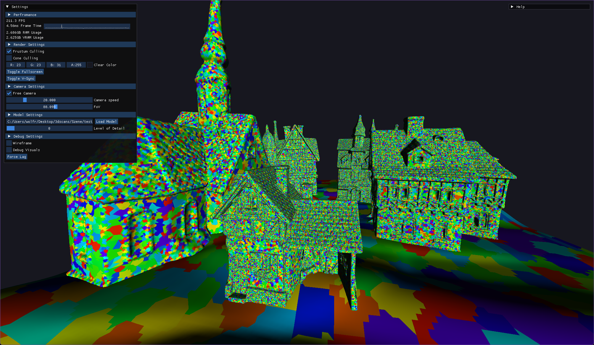

# meshlet-lod

## requirements
- DirectX 12 Ultimate compliant GPU
- NVIDIA RTX 20 series and above or AMD RDNA 2 architecture and newer
- Windows 10 / 11
- Visual Studio 2019 / 2022

## setup instructions
### install the following packages via vcpkg: 
vcpkg install imgui 
vcpkg install directx-headers 
vcpkg install meshoptimizer 
vcpkg install assimp 

### generate visual studio project files via cmake: 
cmake . -B build -A x64 
