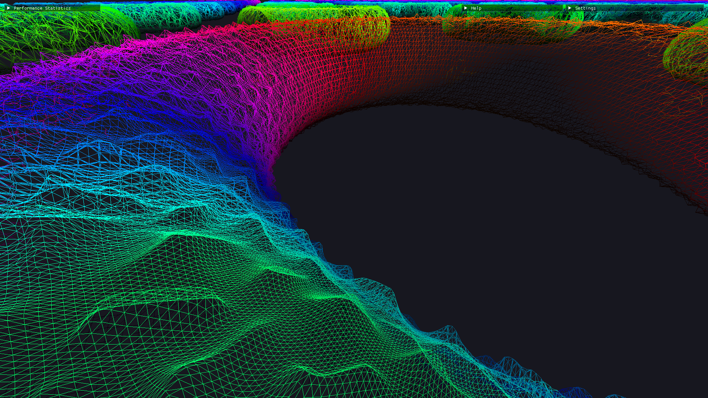
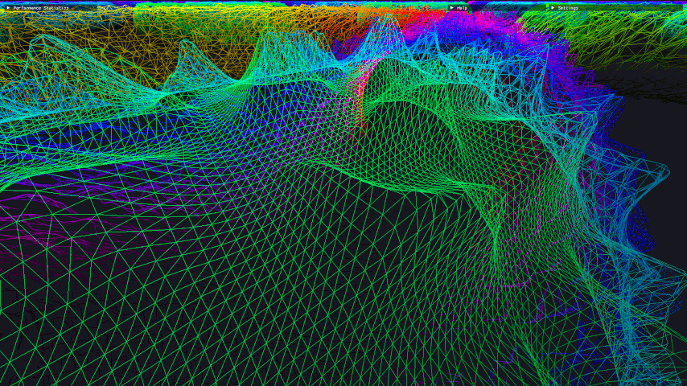

# meshlet-lod


This project contains a custom virtual geometry implementation that has been fully realized within the mesh shading pipeline and DirectX 12. The project was developed as part of my Master Thesis at the [Professur Graphische Datenverarbeitung und Visualisierung](https://www.tu-chemnitz.de/informatik/GDV/). The Level-of-Detail (LOD) approach of Virtual Geometry is expanded upon with Tessellation and Geo-Morphing resulting in the removal of any visual pop-in artefacts, even at lower LOD-Scales. The application provides a simple model/scene renderer that visualizes the implemented LOD-Methods. 

## System Requirements
- DirectX 12 Ultimate compliant GPU
- NVIDIA RTX 20 series and above or AMD RDNA 2 architecture and newer
- Windows 10 / 11
- Visual Studio 2019 / 2022
- CMake & vcpgk
## Setup Instructions
### Install the following packages via vcpkg:<be>
```
vcpkg install imgui[core,dx12-binding,win32-binding]:x64-windows
vcpkg install directx-headers
vcpkg install meshoptimizer
vcpkg install assimp
vcpkg install metis
vcpkg install directxtex[dx12]
```
### Generate visual studio project files via cmake:<be>
```
cmake . -B build -A x64
```

__Due to Linker issues related to the used DirectXTex library, the project currently only compiles in release mode!__

## Show Case
### Visualization of the Geo-Morph Solution
Geo-Morphing allows for a free adjustment of the quality scale of the LOD-System by removing the limitations on triangle/screen-space-error size related to the display resolution. This allows Virtual Geometry to be a more viable LOD-Method for less capable hardware even on higher resolution displays, while staying free of any visual pop-in artefacts.


### Comparison with/without Tessellation
Tessellation can be toggled on/off and offers the possibility of generating more detail in the camera near-field at run-time without any extra pre-compute overhead. The tessellation is used in combination with height-map based vertex displacement.



### Virtual Geometry without Geo-Morphing
Geo-Morphing is fully optional and can be disabled, resulting in a more traditional virtualized geometry approach. Without geo-morphing, the custom tessellation implementation will result in T-junctions at meshlet borders, which may lead to visible cracks. This can be alleviated by disabling tessellation or vertex displacement.


